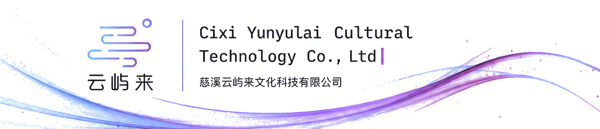
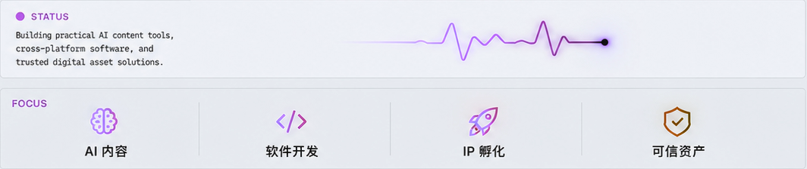

  <picture>
    <source media="(prefers-color-scheme: dark)" srcset="./profile/yunyulai-hero.gif" />
    <source media="(prefers-color-scheme: light)" srcset="./profile/yunyulai-hero-light.gif" />
    
  </picture>

<h1 align="center">慈溪云屿来文化科技有限公司</h1>

  <strong>Cixi Yunyulai Cultural Technology Co., Ltd</strong>

  把想法，做成看得见的成果
   
  AI Content · Flutter Development · IP Incubation · Trusted Digital Assets

  <a href="https://yunyulai.com">公司官网</a>
  ·
  <a href="https://yunyulai.com/#contact">联系合作</a>
  ·
  Maintained by <a href="https://github.com/NeverOvO">LaiHaibo</a>

  <picture>
    <source media="(prefers-color-scheme: dark)" srcset="./profile/status-focus-dark.png" />
    <source media="(prefers-color-scheme: light)" srcset="./profile/status-focus-light.png" />
    
  </picture>

## Open Source Activity

  <picture>
    <source media="(prefers-color-scheme: dark)" srcset="./profile/stats.svg" />
    <source media="(prefers-color-scheme: light)" srcset="./profile/stats-light.svg" />
    
  </picture>
  <picture>
    <source media="(prefers-color-scheme: dark)" srcset="./profile/top-langs.svg" />
    <source media="(prefers-color-scheme: light)" srcset="./profile/top-langs-light.svg" />
    
  </picture>

<picture>
  <source media="(prefers-color-scheme: dark)" srcset="./profile/snake-dark.svg" />
  <source media="(prefers-color-scheme: light)" srcset="./profile/snake-light.svg" />
  
</picture>

Profile visuals refresh automatically with GitHub Actions.

