  

<h1 align="center">慈溪云屿来文化科技有限公司</h1>

  <strong>Cixi Yunyulai Cultural Technology Co., Ltd</strong>

  把想法，做成看得见的成果
   
  AI Content · Flutter Development · IP Incubation · Trusted Digital Assets

  <a href="https://yunyulai.com">公司官网</a>
  ·
  <a href="https://yunyulai.com/#contact">联系合作</a>
  ·
  Maintained by <a href="https://github.com/NeverOvO">LaiHaibo</a>

## STATUS

Building practical AI content tools, cross-platform software, and trusted digital asset solutions.

云屿来把 AI 内容生产、Flutter 跨平台开发和可信内容资产管理结合起来，为企业、商户、创业项目和内容团队提供轻量、清晰、可落地的服务。

<table>
  <tr>
    <td width="25%" align="center"><strong>AI 内容</strong> 内容生产与创作工具</td>
    <td width="25%" align="center"><strong>软件开发</strong> Flutter 跨平台交付</td>
    <td width="25%" align="center"><strong>IP 孵化</strong> 数字内容产品化</td>
    <td width="25%" align="center"><strong>可信资产</strong> 数字确权与可信流转</td>
  </tr>
</table>

## OPEN SOURCE ACTIVITY

  
  

<picture>
  <source media="(prefers-color-scheme: dark)" srcset="./profile/snake-dark.svg" />
  <source media="(prefers-color-scheme: light)" srcset="./profile/snake-light.svg" />
  
</picture>

Profile visuals refresh automatically with GitHub Actions.

